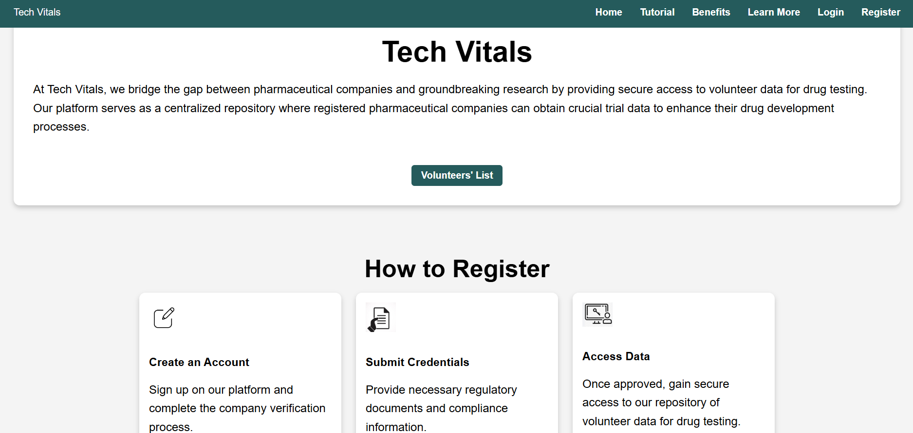
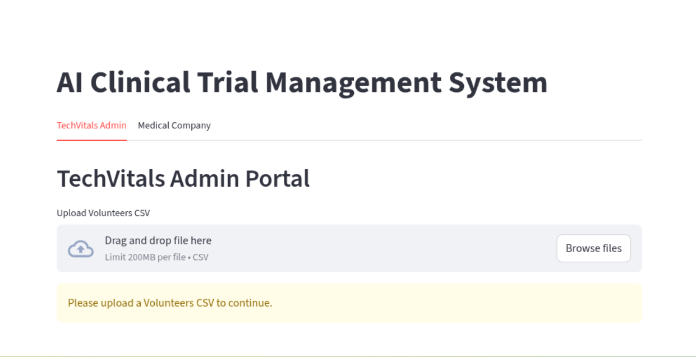

<div align="center">

# 🧬 MedMatch AI
### Clinical Trials AI Recruiter

**An AI-powered volunteer recruitment engine for clinical trials — combining Retrieval-Augmented Generation (RAG) with structured volunteer data to deliver instant eligibility counts, shortlists, and answers.**

[](https://clinicaltrials-blue.vercel.app/)

</div>

---

## 📖 Overview

**MedMatch AI** (built on the **Tech Vitals** platform) bridges the gap between pharmaceutical companies and clinical trial recruitment. It reads unstructured trial-criteria documents (PDFs) and structured volunteer records (CSV), then uses a Retrieval-Augmented Generation pipeline to answer eligibility questions in seconds — turning what used to be a manual, error-prone screening process into a natural-language query.

Pharmaceutical companies get secure, centralized access to volunteer data; the AI layer handles the heavy lifting of matching complex trial criteria — age ranges, biomarkers, disease stage, geography — against the volunteer pool.

---

## 🖼 Screenshots

<div align="center">

**Landing Page — Tech Vitals**



*A centralized platform connecting pharmaceutical companies with verified volunteer data for drug trials.*

<br/>

**Role Selection**


*Users choose their path at registration — Volunteer or Medical Company — for a tailored onboarding flow.*

<br/>

**Admin Portal — Volunteer Data Upload**



*Admins upload the volunteer CSV that powers the AI recruiter's eligibility engine.*

</div>

---

## ✨ Key Features

| Feature | Description |
|---|---|
| 📄 **Criteria Extraction** | Parses trial-criteria PDFs to extract structured inclusion rules (age, disease, biomarkers, stage) |
| 🔍 **RAG-Powered Q&A** | Combines FAISS vector search with an LLM to answer natural-language eligibility questions |
| 👥 **Volunteer Matching** | Filters volunteer records by age, gender, region, disease stage, and biomarker status |
| ⚡ **Instant Shortlists** | Returns eligible counts and volunteer ID shortlists in 2–3 sentence answers |
| 🏢 **Company & Admin Portals** | Separate flows for TechVitals admins (data upload) and medical companies (querying) |
| 🔐 **Role-Based Access** | Distinct onboarding for volunteers vs. medical companies |

---

## 🛠 Tech Stack

<div align="center">

| Layer | Technology |
|---|---|
| **App Framework** | Streamlit |
| **Language** | Python |
| **RAG / Orchestration** | LangChain |
| **Vector Search** | FAISS |
| **LLM** | OpenAI |
| **PDF Parsing** | PyMuPDF (fitz) |
| **Data Handling** | pandas |

</div>

---

## 🧠 How It Works

1. **Parse trial criteria** — Extracts structured inclusion rules from the criteria PDF, e.g.:
   - Age between 30–75 years
   - Non-Small Cell Lung Cancer (NSCLC)
   - EGFR-positive (EGFR+)
   - Stage III or IV
2. **Chunk & embed** — Criteria text is chunked and embedded into a FAISS vector store for semantic retrieval.
3. **Query with RAG** — LangChain orchestrates retrieval + OpenAI generation to interpret natural-language questions.
4. **Filter volunteer data** — The volunteer CSV is filtered by age, gender, region, disease stage, and biomarker status.
5. **Return a concise answer** — Results are summarized in 2–3 sentences, with volunteer IDs where relevant.

---

## 💬 Example Queries

Try these in the **Medical** tab of the app:

- *"How many eligible volunteers?"*
- *"Eligible EGFR+ Stage IV volunteers?"*
- *"Eligible females from Mumbai (show up to 5 IDs)."*

---

## 🚀 Getting Started

### Prerequisites
- Python 3.9+
- An OpenAI API key

### Installation

```bash
git clone <your-repo-url>
cd medmatch-ai

pip install -r requirements.txt
```

### Run the App

```bash
streamlit run app.py
```

### Usage

1. Log in as **TechVitals Admin** and upload the volunteers CSV.
2. Switch to the **Medical Company** tab, upload the trial-criteria PDF.
3. Ask eligibility questions in plain English and get instant, data-backed answers.

---

## 🌐 Live Deployment

| Component | Link |
|---|---|
| 🌐 Website (Landing) | [clinicaltrials-blue.vercel.app](https://clinicaltrials-blue.vercel.app/) |

---

## 📌 Project Structure

```
medmatch-ai/
├── assets/             # README screenshots
├── app.py              # Streamlit application entry point
├── requirements.txt    # Python dependencies
└── README.md
```

---

<div align="center">

Built to make clinical trial recruitment faster, smarter, and more accurate.

</div>
